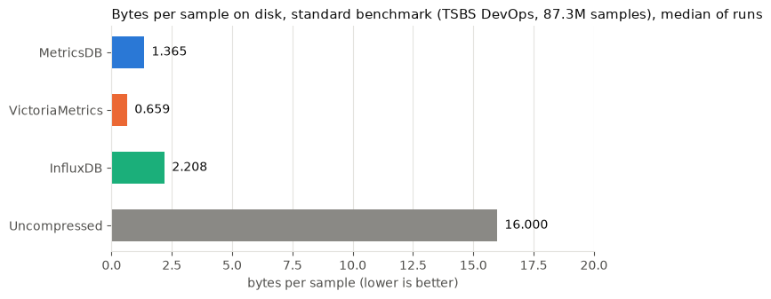
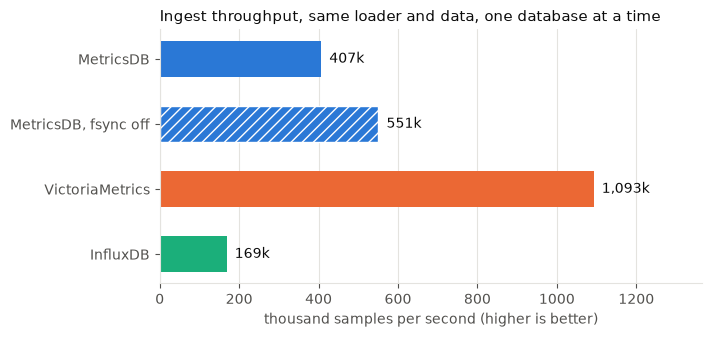
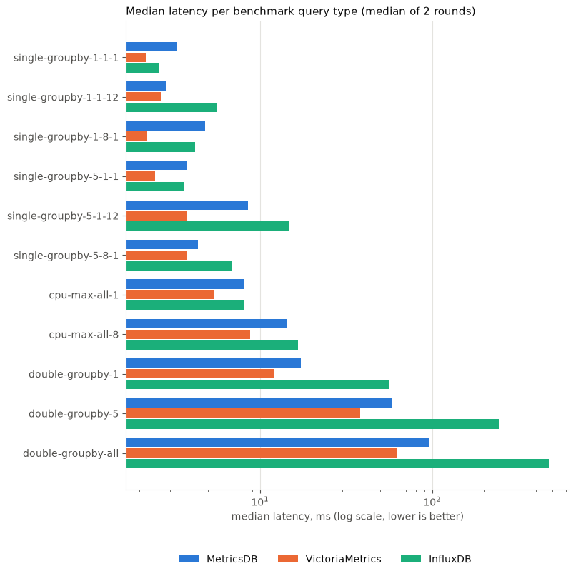
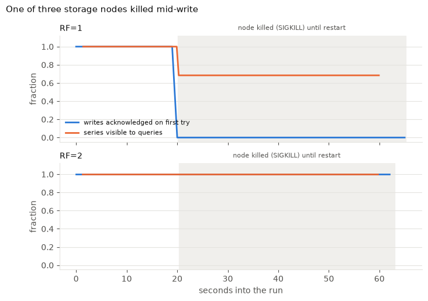
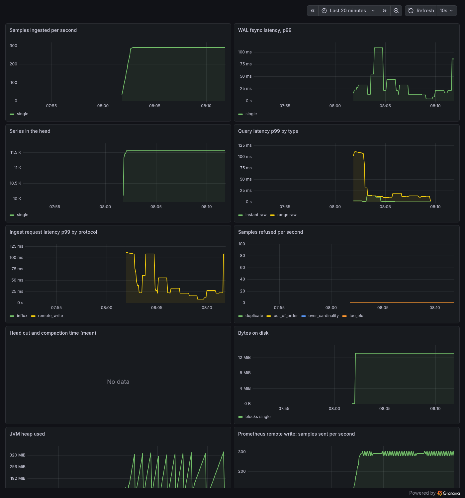

# MetricsDB

MetricsDB is a time-series database for server metrics, written from scratch in Java 21. It
takes Prometheus remote write and the InfluxDB line protocol, keeps a write-ahead log and an
in-memory head, stores older data in immutable memory-mapped blocks compressed with Gorilla
(delta-of-delta timestamps, XOR floats) plus an integer variant for whole-number series,
indexes series with an inverted index over label pairs, answers a subset of PromQL, keeps
five-minute rollups for long ranges, and runs as storage nodes behind a router that replicates
each series to two of them with consistent hashing. **What it does not claim:** it is one
person's database measured on one small machine, not a production system. Every comparison
uses the standard benchmark, TSBS (DevOps use case, 100 hosts, 24 hours, 87.3 million samples
generated by the benchmark, not production traffic), and every database ran on the same
mini PC (AMD Ryzen 3 4300U, 4 cores, 16 GB, WSL2 with 2 vCPU) with its default settings, one at
a time. That box was shared with other jobs, so each result row records the host load. The
designs it follows are credited in [`DESIGN.md`](DESIGN.md).

## What was measured

Every figure is in [`NUMBERS.md`](NUMBERS.md) with the `results/*.jsonl` file it came from.

| Question | MetricsDB | VictoriaMetrics | InfluxDB |
|---|---|---|---|
| Bytes per sample on disk, whole benchmark day (exp1). Uncompressed is 16 | **MDB_BPS** | VM_BPS | IN_BPS |
| Samples ingested per second, same loader, file and concurrency (exp2) | **MDB_IPS** | VM_IPS | IN_IPS |
| The same, MetricsDB with WAL fsync off (VictoriaMetrics acknowledges before its data is fsynced) | MDB_NOFSYNC_IPS | | |
| Benchmark query types where MetricsDB's median latency is lower (exp3) | | MDB_WINS of 11 | |
| Answers differing from VictoriaMetrics' over every benchmark query (exp4) | **0 of 1,100 queries**, POINTS points | | |

Where it loses, and why (details in `NUMBERS.md` and `DESIGN.md`):

LOSSES

## Failures and correctness

| Question | Result |
|---|---|
| Acknowledged samples after `kill -9` of a writing process, 18 random kill points (property test) | **every one read back bit for bit** |
| One of three storage nodes killed mid-write, RF=2 (exp5) | **EXP5_RF2** |
| The same at RF=1 | EXP5_RF1 |
| The killed node restarted with an empty disk, RF=2 | EXP5_WIPE |
| Jepsen-style fault runs: SIGKILL, SIGSTOP and link drops, one node at a time, RF=2 | **FAULTS** |
| 10% of samples late by up to 5 minutes (10-minute out-of-order window) | **0 lost** of 180,000; late by up to 20 minutes: the 7,232 the window rule predicts refused and counted, 0 lost inside the window |
| Query protection: series limit, sample limit, timeout, cardinality limit | each fails with a message naming the limit and its setting (`HttpApiTest`) |

Rollups answer 24-hour queries ROLLUP_SPEEDUP faster than raw chunks with the same answers
(`results/rollups.jsonl`).

## MetricsDB monitoring itself

Every node serves `/metrics` (ingest rate, WAL fsync latency, head series, compaction time,
query latency by type, and on the router node health, hints and partial queries). In the demo a
real Prometheus scrapes it and remote-writes into MetricsDB, and Grafana reads MetricsDB's own
metrics back out of MetricsDB (`scripts/demo.sh`):

## Milestones

| | Deliverable | Done when, as measured |
|---|---|---|
| M0 | Repo, CI, TSBS generating and loading against VictoriaMetrics in Docker | `results/m0_tsbs_baseline.jsonl`: 87,264,000 samples loaded in 276 s by TSBS's own loader |
| M1 | Ingest, WAL, Gorilla blocks, crash recovery | Property tests: random workloads read back exactly through restarts, cuts and compaction; 18 `kill -9`s with every acknowledged sample intact |
| M2 | Inverted index, PromQL subset, TSBS DevOps queries | 0 mismatches against VictoriaMetrics over 1,100 benchmark queries (`results/exp4.jsonl`) |
| M3 | Distribution and the experiments | `results/exp1` to `exp5`, ledger in `NUMBERS.md` |
| M4 | Rollups, Grafana data source demo, bug log, interview notes | `results/rollups.jsonl`, `deploy/`, `BUG_LOG.md` |
| Extra | Out-of-order window, hinted handoff with read repair and Merkle-style anti-entropy, fault-injection suite, self-monitoring, query protection, JMH, Prometheus remote write, CI | `results/ooo.jsonl`, `faults.jsonl`, `jmh-*.jsonl`, `docs/*.png` |

The bugs found on the way, with what found each one, are in [`BUG_LOG.md`](BUG_LOG.md).

README_TAIL
