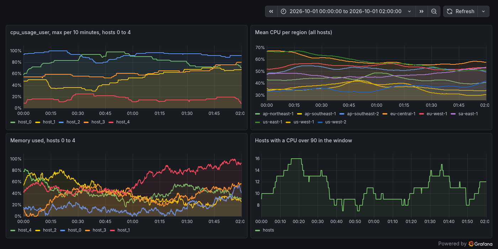

# MetricsDB

MetricsDB is a time-series database for server metrics, written from scratch in Java 21. It
takes Prometheus remote write and the InfluxDB line protocol, keeps a write-ahead log and an
in-memory head, stores older data in immutable memory-mapped blocks compressed with Gorilla
(delta-of-delta timestamps, XOR floats) plus an integer variant for whole-number series,
indexes series with an inverted index over label pairs, answers a subset of PromQL, keeps
five-minute rollups for long ranges, and runs as storage nodes behind a router that replicates
each series to two of them with consistent hashing. **What it does not claim:** it is one
person's database measured on one small machine, not a production system, and it loses to
VictoriaMetrics on every speed and size measure below. Every comparison uses the standard
benchmark, TSBS (DevOps use case, 100 hosts, 24 hours, 87.3 million samples generated by the
benchmark, not production traffic), and every database ran on the same mini PC (AMD Ryzen 3
4300U, 4 cores, 16 GB, WSL2 with 2 vCPU and 6 GB) with its default settings, one at a time. The
box was shared with other jobs, so each result row records the host load. The designs it
follows are credited in [`DESIGN.md`](DESIGN.md).

## What was measured

Every figure is in [`NUMBERS.md`](NUMBERS.md) with the `results/*.jsonl` file it came from.
Medians of 4 ingest runs and 2 query rounds, ranges in `NUMBERS.md`.

| Question | MetricsDB | VictoriaMetrics | InfluxDB |
|---|---|---|---|
| Bytes per sample on disk after loading the benchmark day (exp1). Uncompressed is 16 | **1.365** (11.7x smaller) | 0.659 | 2.208 |
| Samples ingested per second, same loader, file and concurrency (exp2) | **521,000** | 922,000 | 336,000 |
| The same with MetricsDB's WAL fsync off (VictoriaMetrics acknowledges before its data is fsynced) | 517,000 | | |
| Median query latency per benchmark query type (exp3), MetricsDB's relative to the others | | MetricsDB slower on all 11 types, 1.07x to 2.24x (median 1.52x) | MetricsDB faster on 7 types (3x to 5x on the heavy aggregations), slower on 3 |
| Answers that differ from VictoriaMetrics' over every benchmark query (exp4) | **0 of 1,100**, 2.6 million points compared | | |
| Ingest through a router into 3 storage nodes at RF=2, same VM (exp2) | 157,000 samples/s, each stored twice | | |

Where it loses to VictoriaMetrics, and why:

- **Size, 2.1x larger.** Gorilla and the integer variant are bit-packing with no entropy coder;
  VictoriaMetrics converts floats to decimal integers and runs zstd over its blocks. MetricsDB
  also keeps five-minute rollups (18% of its bytes), which VictoriaMetrics does not.
- **Ingest, 1.8x slower.** The profile is spread over the parser, per-series locks (four writers
  carry the same 10,100 series in the same order) and bit-level appends; a fifth of the
  benchmark's samples arrive a few seconds late through four concurrent writers and take the
  out-of-order path. MetricsDB also fsyncs every batch before acknowledging, but turning that off
  changed nothing measurable (group commit already amortizes it).
- **Queries, 1.5x slower (median).** Heavy queries are bound by decoding Gorilla bit streams
  (VictoriaMetrics decodes byte-aligned integer blocks); light ones by a fixed per-request cost of
  Tomcat and Spring MVC (a health check takes 2.9 ms at the median against 1.4 ms on
  VictoriaMetrics, same machine).


## Failures and correctness

| Question | Result |
|---|---|
| A writing process SIGKILLed at random moments, 18 times (property test, also in CI) | **every acknowledged sample read back bit for bit** |
| One of three storage nodes SIGKILLed mid-write and restarted, RF=2 (exp5) | **0 of 612,000 acknowledged samples lost**, 0 writes refused, 78 of 78 queries during the outage complete |
| The same at RF=1 | 0 lost (the client retried), but 453 of 653 write batches refused and every query during the outage partial, with as few as 684 of 1,000 series visible |
| The killed node restarted with an empty disk, RF=2 | 0 lost; anti-entropy found 100 mismatched ring ranges and wrote back exactly the 63,960 missing samples, then replicas were identical |
| Fault injection: SIGKILL, SIGSTOP and link drops, one node at a time, 5 runs of 90 s at RF=2 | **0 of 750,000 acknowledged samples lost** across 40 faults, and 0 missing on any replica after repair |
| 10% of samples late by up to 5 minutes (10-minute out-of-order window) | **0 lost** of 180,000; late by up to 20 minutes, exactly the 7,232 samples the rule predicts refused and counted |
| Query protection: series limit, sample limit, timeout, cardinality limit (HTTP test) | each fails with a message naming the limit and its setting |


Rollups answer 24-hour queries 3.3x to 5.1x faster than raw chunks with the same answers
(`results/rollups.jsonl`), and shorter windows that are not bucket-aligned use rollup buckets
plus raw samples at the two edges, which is part of exp3's MetricsDB numbers.

## MetricsDB monitoring itself

Every node serves `/metrics` (ingest rate, WAL fsync latency, head series, compaction time,
query latency by type, and on the router node health, hints and partial queries). In the demo a
real Prometheus scrapes it and remote-writes into MetricsDB, and Grafana reads MetricsDB's own
metrics back out of MetricsDB (`scripts/demo.sh`):


The standard benchmark's first two hours, queried through Grafana's Prometheus data source:



## Milestones

| | Deliverable | Done when, as measured |
|---|---|---|
| M0 | Repo, CI, TSBS generating and loading against VictoriaMetrics in Docker | `results/m0_tsbs_baseline.jsonl`: 87,264,000 samples loaded in 276 s by TSBS's own loader |
| M1 | Ingest, WAL, Gorilla blocks, crash recovery | Property tests: random workloads read back exactly through restarts, cuts and compaction; 18 `kill -9`s with every acknowledged sample intact |
| M2 | Inverted index, PromQL subset, TSBS DevOps queries | 0 mismatches against VictoriaMetrics over 1,100 benchmark queries (`results/exp4.jsonl`) |
| M3 | Distribution and the experiments | `results/exp1` to `exp5`, ledger in `NUMBERS.md` |
| M4 | Rollups, Grafana data source demo, bug log, interview notes | `results/rollups.jsonl`, `deploy/`, `BUG_LOG.md` |
| Extra | Out-of-order window, hinted handoff with read repair and Merkle-style anti-entropy, fault-injection suite, self-monitoring, query protection, JMH, Prometheus remote write, CI | `results/ooo.jsonl`, `faults.jsonl`, `jmh-*.jsonl`, `docs/*.png` |

The bugs found on the way, with what found each one, are in [`BUG_LOG.md`](BUG_LOG.md).

## Run it

Needs JDK 21 and Docker. The benchmark runs need TSBS (Go; `bench/scripts/setup_tools.sh` and
`bench/scripts/gen_tsbs.sh` set it up) and use about 8 GB of scratch disk
outside the repo (`$HOME/metricsdb-work`).

```bash
./gradlew build                        # unit, property, kill -9 crash, HTTP and VictoriaMetrics parity tests
java -jar server/build/libs/metricsdb.jar --metricsdb.data-dir=/tmp/mdb      # single node on :9201
curl --data-binary 'cpu,host=a usage=42 1790812800000000000' localhost:9201/write
curl 'localhost:9201/api/v1/query?query=cpu_usage&time=1790812800'

scripts/demo.sh up                     # MetricsDB + Prometheus (remote write) + Grafana on 127.0.0.1:3301
bench/scripts/final_run.sh             # every measurement in results/, then charts and NUMBERS.md
bench/build/install/bench/bin/bench faults --jar server/build/libs/metricsdb.jar --runs 5
```

A three-node cluster: start three storage nodes and a router.

```bash
for i in 0 1 2; do java -jar server/build/libs/metricsdb.jar --server.port=$((9211+i)) \
  --metricsdb.role=storage --metricsdb.data-dir=/tmp/n$i & done
java -jar server/build/libs/metricsdb.jar --server.port=9201 --metricsdb.role=router \
  --metricsdb.data-dir=/tmp/router --metricsdb.cluster.replication-factor=2 \
  --metricsdb.cluster.nodes=n0=http://127.0.0.1:9211,n1=http://127.0.0.1:9212,n2=http://127.0.0.1:9213
```

## What is where

| Path | What |
|---|---|
| `core/` | The engine, no framework: Gorilla and integer chunk codecs (`encoding/`), label index and posting lists (`index/`), WAL with group commit and checkpoints (`wal/`), head series with the out-of-order buffer (`head/`), blocks, rollups and compaction (`block/`, `storage/Tsdb`), the PromQL subset (`promql/`), line protocol, remote write and snappy (`ingest/`), consistent hashing, wire format and anti-entropy digests (`cluster/`) |
| `server/` | Spring Boot: Prometheus query API, write endpoints, the storage node's internal API, the router (replication, hinted handoff, read repair, anti-entropy, partial results), self-monitoring |
| `bench/` | The experiment harness (`bench load`, `querybench`, `diff`, `exp5`, `ooo`, `faults`), scripts that run each database in turn, `ledger.py` (writes `NUMBERS.md`), `charts.py` (writes `docs/*.png`), and a small Go tool that reads TSBS query files |
| `core/src/jmh` | JMH microbenchmarks |
| `deploy/` | Prometheus and Grafana (provisioned data source and two dashboards) for the demo |
| `results/` | Every measured run, one JSON row each, with machine and load |
| `DESIGN.md`, `NUMBERS.md`, `BUG_LOG.md` | Why it is built this way and whose ideas it uses, every figure with its source, every bug with what found it |
